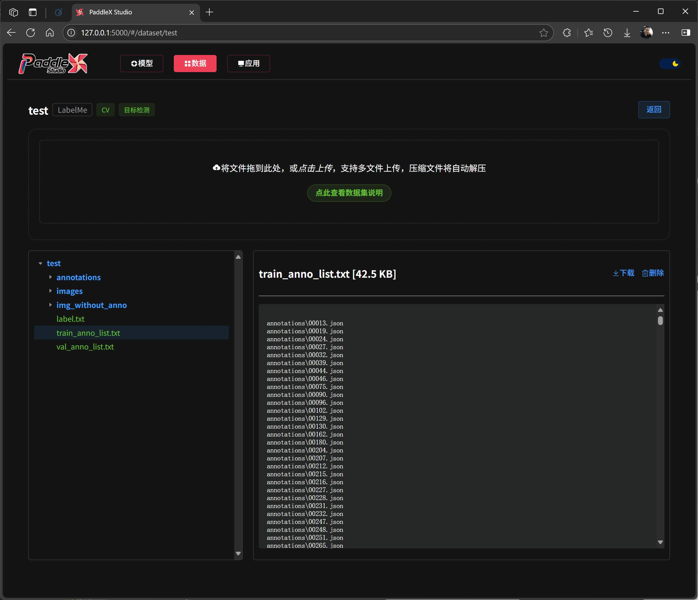

# PaddleX Studio

#### 介绍
PaddleX Studio是PaddleX的图形化界面工具，提供直观的可视化操作界面，帮助用户更便捷地使用PaddleX进行模型训练、评估和部署。

#### 软件架构
PaddleX Studio基于Python开发，采用前后端分离架构，前端使用Vue.js构建，后端通过Python Flask提供API服务，核心功能依赖PaddleX深度学习框架。

#### 安装教程

1. 首先安装PaddleX深度学习框架，请参考官方文档：[PaddleX安装指南](https://paddlepaddle.github.io/PaddleX/latest/index.html)
2. 克隆本仓库到本地：`git clone https://gitee.com/yourusername/PaddleX-Studio.git`
3. 进入项目目录：`cd PaddleX-Studio`
4. 安装依赖包：`pip install -r requirements.txt`
5. 修改配置文件：编辑config.json文件，指定PaddleX的安装路径

#### 使用说明

1. 启动应用：`python app.py`
2. 在浏览器中访问：http://localhost:5000
3. 首次使用需在设置中确认PaddleX路径是否正确配置
4. 按照界面指引创建项目、导入数据并开始模型训练

#### 特性

* 提供图形化模型、数据、应用管理功能

* 直接选择，查看说明，省去翻看文档

* 数据检查结果可视化

* 训练输出实时查看，模型打包下载，多个训练任务排队执行

* 数据集提供目录化管理，zip/tar文件自动解压导入，文本文件和图片支持在线预览

* ...未完待续

#### 参与贡献

1. Fork 本仓库
2. 新建 Feat_xxx 分支
3. 提交代码
4. 新建 Pull Request
