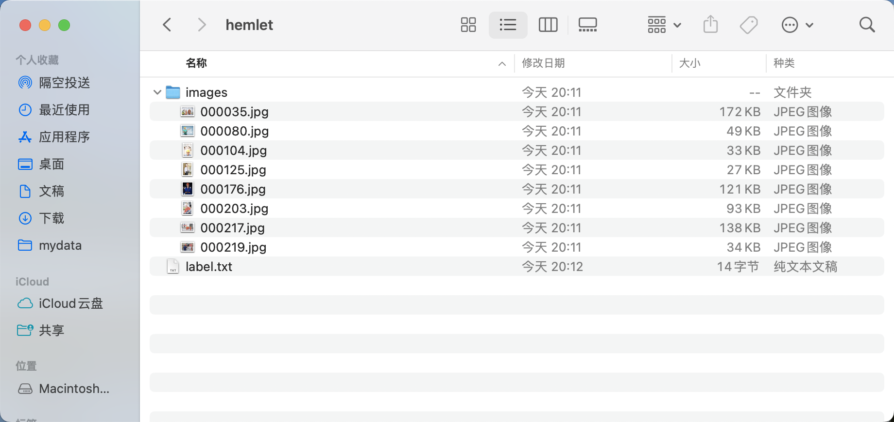
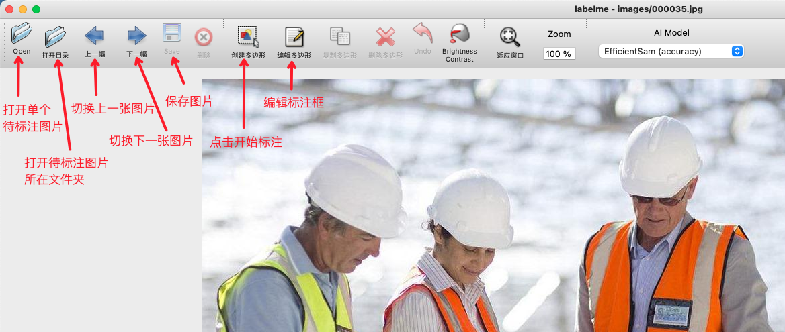
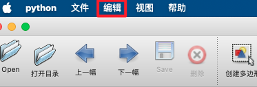
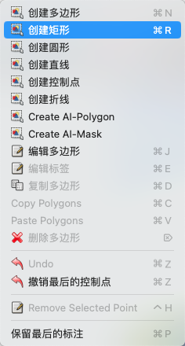
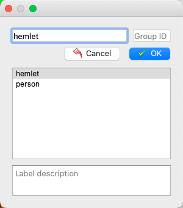
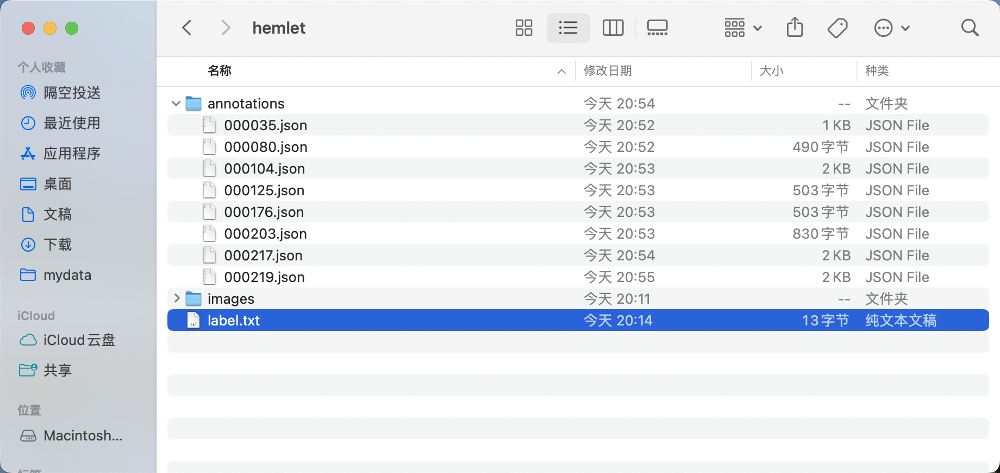
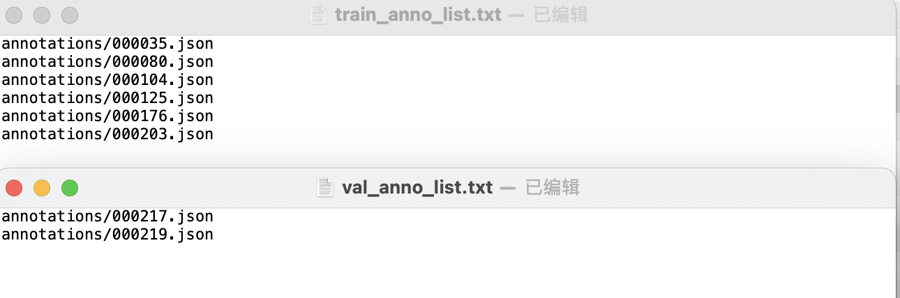
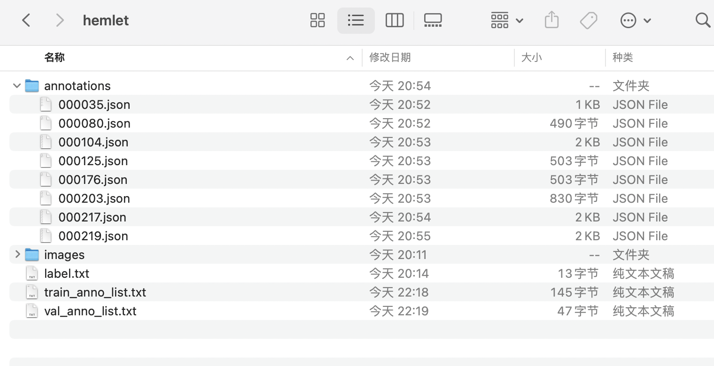

## 1. Labelme 标注

### 1.1 Labelme标注工具介绍
`Labelme` 是一个 `python` 语言编写，带有图形界面的图像标注软件。可用于图像分类，目标检测，图像分割等任务，在目标检测的标注任务中，标签存储为 `JSON` 文件。

### 1.2 Labelme 安装
为避免环境冲突，建议在 `conda` 环境下安装。

```bash
conda create -n labelme python=3.10
conda activate labelme
pip install pyqt5
pip install labelme
```

### 1.3 Labelme 标注过程
#### 1.3.1 准备待标注数据
* 创建数据集根目录，如 `hemlet`。
* 在 `hemlet` 中创建 `images` 目录（必须为`images`目录），并将待标注图片存储在 `images` 目录下，如下图所示：



* 在 `hemlet` 文件夹中创建待标注数据集的类别标签文件 `label.txt`，并在 `label.txt` 中按行写入待标注数据集的类别。安全帽检测数据集的`label.txt`为例，如下图所示：


#### 1.3.2 启动 Labelme
终端进入到待标注数据集根目录，并启动 `Labelme` 标注工具:

```bash
cd path/to/hemlet
labelme images --labels label.txt --nodata --autosave --output annotations
```

* `images` 为待标注图片所在目录。
* `labels` 为目标类别标签文件路径。
* `flags` 为图像分类标签文件路径。
* `nodata` 停止将图像数据存储到 `JSON`文件。
* `autosave` 自动存储。
* `output` 标签文件存储路径。

#### 1.3.3 开始图片标注
1. 启动 `Labelme` 后如图所示：

   

2. 点击"编辑"选择标注类型

   

3. 选择创建矩形框

   

4. 在图片上拖动十字框选目标区域

   

5. 再次点击选择目标框类别

   

6. 标注好后点击存储。（若在启动 `Labelme` 时未指定 `output` 字段，会在第一次存储时提示选择存储路径，若指定 `autosave` 字段使用自动保存，则无需点击存储按钮）。

   

7. 然后点击 `Next Image` 进行下一张图片的标注。

   

8. 最终标注好的标签文件如图所示:

   


9. 调整目录得到安全帽检测标准`Labelme`格式数据集
  * 在数据集根目录创建`train_anno_list.txt`和`val_anno_list.txt`两个文本文件，并将`annotations`目录下的全部`json`文件路径按一定比例分别写入`train_anno_list.txt`和`val_anno_list.txt`，也可全部写入到`train_anno_list.txt`同时创建一个空的`val_anno_list.txt`文件，使用数据划分功能进行重新划分。`train_anno_list.txt`和`val_anno_list.txt`的具体填写格式如图所示：

    

  * 经过整理得到的最终目录结构如下：

    
